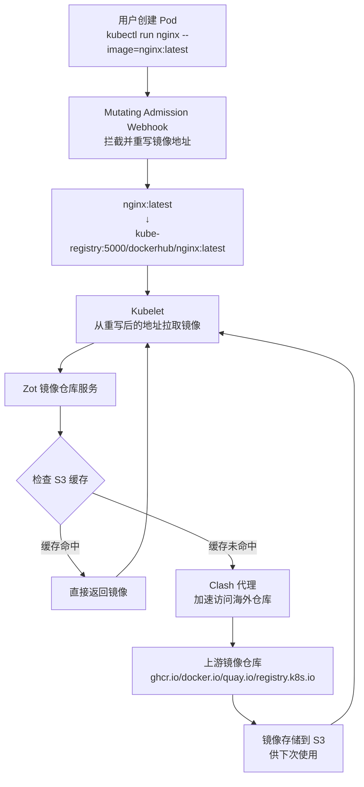

# kube-registry

本仓库提供一个chart，在k8s内部署一套镜像仓库，支持clash订阅代理和pull through cache, 无需配置每个docker的registry-mirror.

**支持的上游仓库**：
- Docker Hub → `/dockerhub/*`
- GHCR → `/ghcr/*`
- Quay.io → `/quay/*`
- Kubernetes Registry → `/k8s/*`

> !!Attention 项目未完成!!
> 
> 已实现:
> 1. chart 自动化发布
> 2. clash-sidecar已经可用
>
> 简单测试发现 zot 似乎不可用,可能考虑更换成 Distribution 或 Harbor

## 快速开始

先创建一个测试k8s集群，如果你了解kind，可以参考 [kind.yaml](./test/kind.yaml) 进行创建。

### 1. 添加仓库

下载本项目的helm仓库

```bash
helm repo add [repo-name] https://qiudeng7.github.io/kube-registry/
```

### 2. 配置values（*必须的步骤）

你需要提供一个额外的对象存储用于保存镜像（如果你想要 chart 内的对象存储，欢迎pr），如果需要开启clash，还需要提供 clash 订阅链接。

一个基本的`values.yaml`配置如下

```yaml
# 镜像仓库配置
zot:
  # chart 内默认使用ghcr源，这里修改为daocloud代理，方便国内下载
  image:
    repository: ghcr.m.daocloud.io/project-zot/zot

  # 对象存储配置（必填）
  s3:
    config:
      region: ""  # 必填：例如 us-east-1
      bucket: ""  # 必填：S3 存储桶名称
      regionEndpoint: ""  # 必填: 自定义 S3 endpoint
    secret:
      accessKeyId: ""  # 必填
      secretAccessKey: ""  # 必填

# Clash 代理配置
clash:
  enabled: true  # 是否启用 clash 代理，只对本 chart 的镜像仓库生效
  subscriptionUrl: ""  # clash 订阅链接

  # chart 内默认使用ghcr源，这里修改为daocloud代理，方便国内下载
  image:
    repository: ghcr.m.daocloud.io/qiudeng7/kube-registry/clash-sidecar

# Webhook 配置
webhook:
  # webhook开关，如果打开则集群内创建所有pod用到的镜像都会通过本chart的镜像仓库进行代理和缓存
  enabled: true
  # chart 内默认使用ghcr源，这里修改为daocloud代理，方便国内下载
  image:
    repository: ghcr.m.daocloud.io/qiudeng7/kube-registry/webhook-server
```

### 3. 部署

```bash
helm install [release-name] [repo-name]/kube-registry -f values.yaml
```

## 工作原理



## 开发者文档

见 [开发者文档](./docs/development.md)


## Todo

1. 考虑把 zot 更换为 Harbor 或者 Distribution
2. 用户自定义 clash 配置
3. 开放 clash pod svc，允许其他服务访问代理