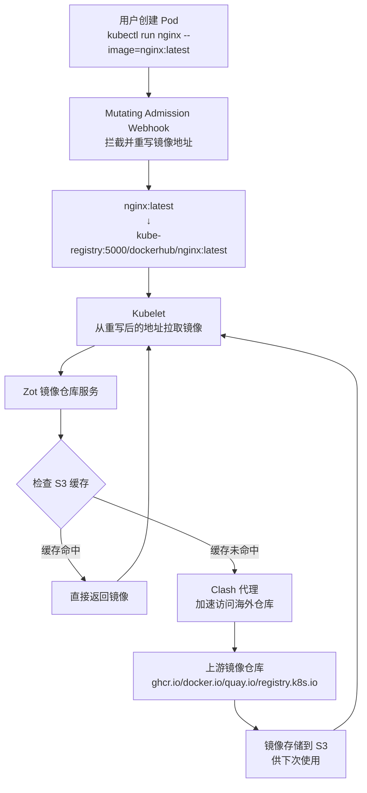

# kube-registry

本仓库提供一个chart，在k8s内部署一套镜像仓库，支持clash订阅代理和pull through cache, 无需配置每个docker的registry-mirror.

**支持的上游仓库**：
- Docker Hub → `/dockerhub/*`
- GHCR → `/ghcr/*`
- Quay.io → `/quay/*`
- Kubernetes Registry → `/k8s/*`

## 工作原理

## 开发者文档

见 